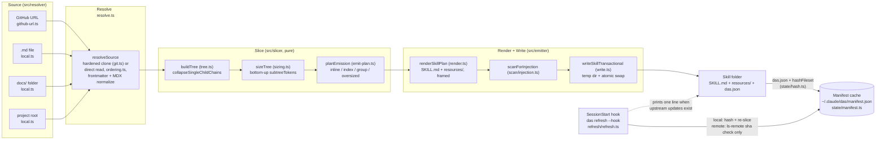
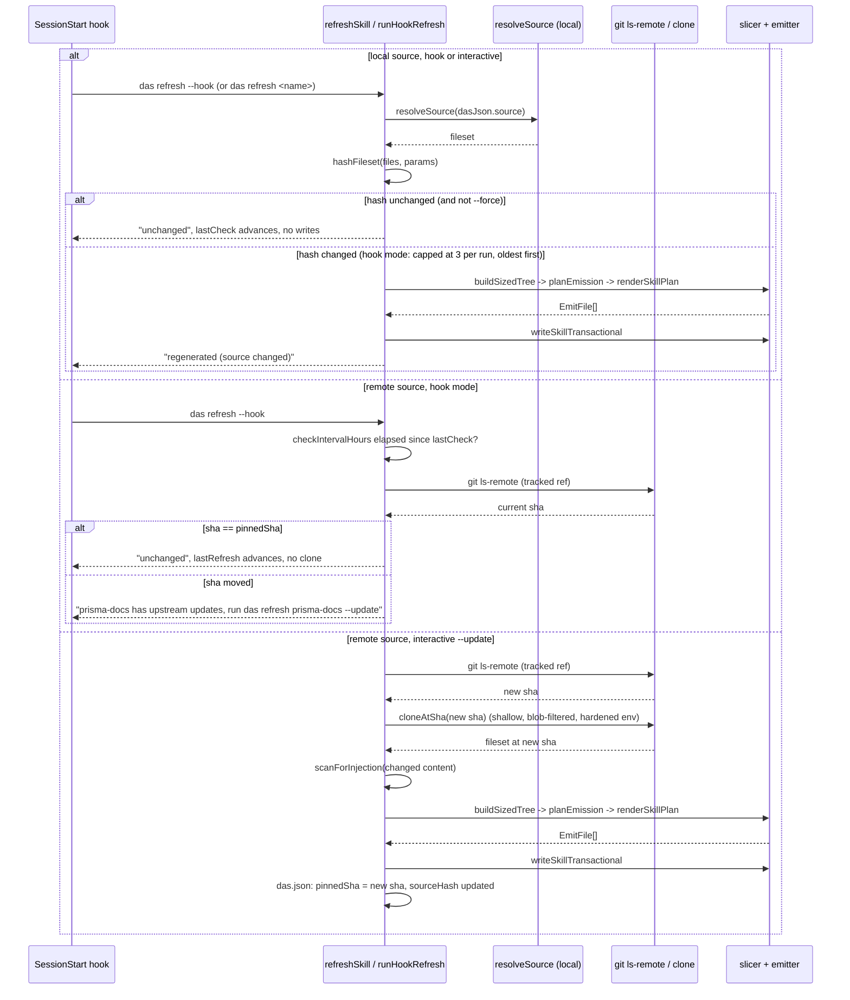
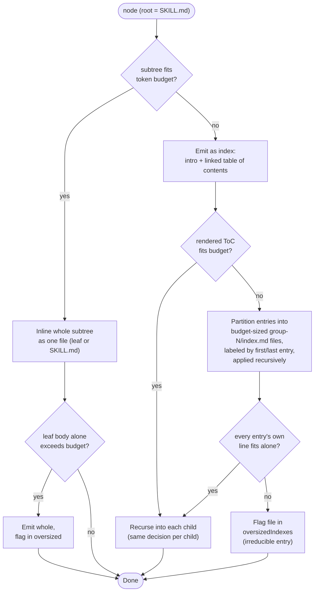

# Architecture

This describes the as-built pipeline in `src/`. For the full design rationale, see `docs/superpowers/specs/2026-07-22-das-design.md`; for the phased build history, see `docs/superpowers/plans/2026-07-22-das-cli.md`.

## Pipeline: resolve, slice, render, write

Every source type funnels through the same four stages. The resolver produces a plain fileset; the slicer is pure (no filesystem, no network); the emitter is the only stage that touches disk for the skill itself.



Two mechanisms stay distinct: `das` **regenerates** skill files on disk; Claude Code **loads** them itself. Nothing in this pipeline pushes content into a running session.

## Refresh: pin-and-check

`refreshSkill` and `runHookRefresh` (`src/refresh/refresh.ts`) branch on source type and invocation mode. A local source is always re-hashed and, on a change, fully regenerated. A remote source is checked with `git ls-remote` only, unless the caller is an interactive `das refresh --update`.



Key invariants this diagram enforces:

- **Hook mode never clones.** The only path that runs `git clone` is the bottom branch, reached exclusively through `mode.kind === "interactive" && mode.update === true`. A hook-mode remote check is one `git ls-remote` at most, gated by `checkIntervalHours` so it doesn't even run every session.
- **A missing or unreachable source never throws.** Both the local resolve and the `ls-remote` call are wrapped so a failure reports `"stale"` and leaves the existing skill untouched; `das list` surfaces the staleness.
- **Local regeneration in hook mode is capped at 3 skills per run, oldest `lastRefresh` first.** Anything beyond the cap waits for the next `SessionStart`, and each skill's work is bounded by a per-skill timeout so one hung resolve never stalls the rest.
- **A remote sha that moved does not silently update `das.json`.** It stays flagged (`updateAvailable`) and re-reported on every subsequent hook run until an explicit `--update` clears it, so the update is never lost by going unmentioned once.

## Skill-tree emission

`planEmission` (`src/slicer/emit-plan.ts`) walks the sized tree top-down, deciding per node whether its whole subtree can be inlined or must become an index with children of its own.



Applied to a documentation source, this produces a tree like:

```
resources/
  getting-started.md              (inlined: whole subtree fit the budget)
  guides/
    index.md                      (ToC: too many children to inline)
    group-1/
      index.md                    (labeled "Authentication – Deployment")
      authentication.md
      configuration.md
      deployment.md
    group-2/
      index.md                    (labeled "Monitoring – Webhooks")
      monitoring.md
      webhooks.md
  api-reference.md                (oversized: single huge table, emitted
                                    whole, warned about when das add finishes)
```

Grouping (`group-1`, `group-2`, ...) only appears when a single index's table of contents itself would not fit the budget; most skills never need it. Single-child chains collapse before this stage runs (`collapseSingleChildChains`, wired into `buildSizedTree`), so a folder containing exactly one file never produces a redundant nesting level. Every path this stage decides is later `path.resolve`d and containment-checked in `writeSkillTransactional` before anything is written, so a malicious or malformed node name can plan a path but never write outside the skill directory.

## Module map

| Concern                     | Modules                                                                 |
| --------------------------- | ----------------------------------------------------------------------- |
| Shared types                | `src/types.ts`                                                          |
| Markdown primitives         | `src/markdown/{frontmatter,mdx,tokens,slug,summary}.ts`                 |
| Resolve                     | `src/resolver/{resolve,local,github-url,git,ordering}.ts`               |
| Slice (pure)                | `src/slicer/{tree,sizing,build-sized-tree,emit-plan}.ts`                |
| Render + write              | `src/emitter/{render,das-json,write}.ts`                                |
| Injection scan (pure)       | `src/scan/injection.ts`                                                 |
| State: manifest, lock, hash | `src/state/{manifest,lock,hash}.ts`                                     |
| Refresh engine              | `src/refresh/refresh.ts`                                                |
| SessionStart hook install   | `src/settings/hooks.ts`                                                 |
| CLI shells + command cores  | `src/cli/{index,add,refresh-cmd,list,remove,doctor,hook-cmd,wizard}.ts` |

The pure-core / effectful-shell split runs through this whole map: everything under `markdown/`, `slicer/`, and `scan/` is pure functions over in-memory values; everything under `resolver/`, `emitter/`, `state/`, `refresh/`, and `settings/` wraps an effect (filesystem, git, the clock, a lockfile) behind a function signature that `src/cli/*.ts` injects a production implementation into and tests inject a fake into. See `CLAUDE.md` for the contribution rules this split implies.
