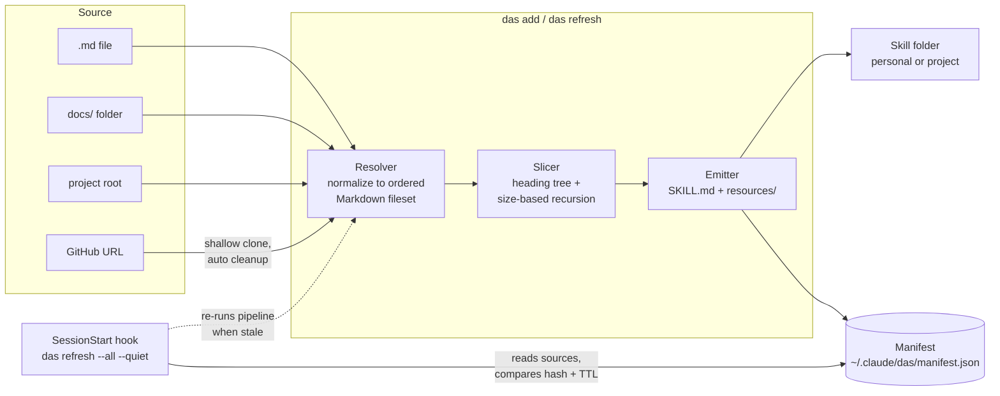

# DAS (Documentation as a Skill) Design Spec

**Date:** 2026-07-22
**Status:** Draft, pending red team review
**Repo:** `~/projects/das-cli/`

## Overview

DAS is a standalone TypeScript CLI (`das`) that converts existing documentation into a Claude Code skill built on progressive disclosure. Point it at a Markdown file, a docs folder, a project root, or a GitHub URL. It slices the documentation into a `SKILL.md` table of contents plus a tree of resource files, sized so Claude only ever loads what it needs. A SessionStart hook keeps the generated skill in sync with the source.

**Positioning:** DAS is a bridge. Teams keep their existing documentation site (Docusaurus, MkDocs, Astro Starlight, plain Markdown) as the human-facing source of truth. DAS makes that same source legible to Claude Code with zero duplication and zero drift, because the skill regenerates from source every session.

## Goals

1. One command turns any documentation source into a working Claude Code skill.
2. Token efficiency with a hard guarantee: no single generated file exceeds the token budget, so the cost of reaching any fact is `budget x depth`, and depth grows logarithmically with doc size.
3. Freshness without effort: a SessionStart hook re-slices local sources every session and remote sources past a TTL.
4. Safety: DAS only ever overwrites folders it generated. It can never clobber a hand-written skill.

## Non-Goals (v1)

- Authoring or editing documentation. DAS reads, slices, and emits. It never modifies sources.
- Full site-generator adapters (`sidebars.js`, `mkdocs.yml` nav parsing). Frontmatter awareness covers ~90% of real docs sites.
- Non-Markdown sources (HTML scraping, PDFs, OpenAPI specs).
- Watch mode or daemon. Refresh happens at session start or on demand.

## Architecture



## Components

### 1. CLI (`das`)

Stack: TypeScript, Commander, Inquirer, Chalk, vitest, pnpm. Same conventions as `cpm-cli`.

| Command              | Behavior                                                                                                                                        |
| -------------------- | ----------------------------------------------------------------------------------------------------------------------------------------------- |
| `das add <source>`   | Resolve source, preview the skill (name, description, section tree), run the install wizard, generate, register in manifest, offer hook install |
| `das refresh [name]` | Re-slice one skill from its source. `--all` for every registered skill, `--force` to ignore TTL and hash checks, `--quiet` for hook usage       |
| `das list`           | Show registered skills: name, source, scope, last refresh, staleness                                                                            |
| `das remove <name>`  | Delete the generated skill folder (marker-checked) and its manifest entry                                                                       |

Wizard (`das add`), in order:

1. **Install scope:** personal `~/.claude/skills/<name>/` (default) or current project `.claude/skills/<name>/`.
2. **Skill name:** default derived from doc title (slugified), editable.
3. **Description:** default derived from title plus first intro paragraph, editable. This is what Claude uses to decide when to invoke the skill, so the wizard shows it prominently.
4. **Hook install:** if no DAS SessionStart hook exists in the scope's settings, offer to add it (default yes).

All wizard steps have flag equivalents (`--scope`, `--name`, `--description`, `--no-hook`, `--yes`) for non-interactive use.

### 2. Resolver

Normalizes any source into an ordered set of Markdown files.

| Input                              | Resolution                                                                                                                                                                                  |
| ---------------------------------- | ------------------------------------------------------------------------------------------------------------------------------------------------------------------------------------------- |
| Path to `.md`/`.mdx` file          | That file                                                                                                                                                                                   |
| Path to folder containing Markdown | All `.md`/`.mdx` recursively, folder nesting preserved as hierarchy                                                                                                                         |
| Path to project root               | Discovery: `docs/`, `documentation/`, `doc/`, else root-level `*.md` with README first                                                                                                      |
| GitHub URL                         | `git clone --depth 1 --filter=blob:none` to a temp dir inside the OS temp folder, project-root discovery, slice, then delete the clone in a `finally` block so cleanup runs even on failure |

Frontmatter handling (applies to every file):

- `title:` overrides the first H1 as the section name.
- `sidebar_position:` (also `sidebar.order` for Starlight) controls ordering. Fallback: numeric filename prefixes (`01-intro.md`), then alphabetical.
- `draft: true` files are skipped.
- MDX: strip `import`/`export` statements and JSX component tags, keep inner text content. Docusaurus admonitions (`:::note`) keep their content with the marker lines removed.

Exclusions: `node_modules`, hidden folders, `CHANGELOG.md`, license files. Files over 1MB are skipped with a warning (`--include-large` overrides).

### 3. Slicer

Builds one heading tree across the whole fileset:

- Folder nesting and file order define the top of the tree. Within a file, H1 > H2 > H3 define the rest.
- Every node gets a slug (from heading text, numeric suffix on collision) and a one-line summary (first sentence of its body, truncated).

Size-based recursive emission with a **universal token budget** (default 2000 tokens, `chars / 4` estimate, configurable per skill):

1. If a node's full content fits the budget, emit it as one resource file.
2. If it exceeds the budget, emit an index file (the node's own intro text plus a linked ToC of children) and recurse into children.
3. `SKILL.md` is just the root index and obeys the same budget. If the top-level ToC alone would exceed the budget, group entries into category index files.
4. Leaf sections with no subheadings that still exceed the budget are split on paragraph boundaries into sequential part files (`<slug>-1.md`, `<slug>-2.md`), each within budget, listed in order in the parent index.

The guarantee: every file Claude opens is at most one budget's worth of tokens, every file states what is one hop away, and unread files cost nothing.

### 4. Emitter

Output layout:

```
<skills-dir>/<name>/
  SKILL.md
  resources/
    <slug>.md
    <slug>/            # only when a section recursed
      index.md
      <child-slug>.md
```

`SKILL.md` frontmatter:

```yaml
---
name: <skill-name>
description: <wizard-approved description>
metadata:
  generated-by: das
  das-version: <semver>
  source: <path or URL>
  source-hash: <sha256 of fileset>
---
```

The `metadata.generated-by: das` marker is the ownership stamp. `das refresh` and `das remove` verify it before touching a folder. If the target folder exists without the marker, DAS aborts with an error and never overwrites.

### 5. Manifest

`~/.claude/das/manifest.json`, schema versioned:

```json
{
  "version": 1,
  "skills": [
    {
      "name": "prisma-docs",
      "source": {
        "type": "github",
        "url": "https://github.com/prisma/docs",
        "ref": "main"
      },
      "scope": { "type": "personal" },
      "skillPath": "/Users/alexandra/.claude/skills/prisma-docs",
      "tokenBudget": 2000,
      "ttlHours": 24,
      "lastRefresh": "2026-07-22T14:00:00Z",
      "sourceHash": "sha256:..."
    }
  ]
}
```

Project-scoped skills store absolute `skillPath` values, so one personal manifest covers every project. Local sources use `{ "type": "path", "path": "...", "kind": "file" | "folder" | "project" }`.

### 6. Refresh + hook

`das refresh` per skill:

1. **Local source:** hash the current fileset (sha256 over sorted relative paths + contents). Hash matches manifest: done, no writes. Hash differs: re-run the pipeline, update manifest.
2. **Remote source:** if `now - lastRefresh < ttlHours` and not `--force`, skip entirely (no network). Past TTL: shallow clone, hash, same comparison, cleanup.
3. **Missing or failing source:** skip with a warning to stderr, leave the existing skill untouched. Offline never breaks a session.

Hook registration (SessionStart in `~/.claude/settings.json`, or project settings for project scope):

```json
{
  "hooks": {
    "SessionStart": [
      {
        "hooks": [
          {
            "type": "command",
            "command": "das refresh --all --quiet",
            "timeout": 30
          }
        ]
      }
    ]
  }
}
```

`--quiet` suppresses all stdout on the happy path. The timeout caps worst-case session-start impact; a timed-out refresh just means slightly stale docs until the next session.

## Performance Controls

1. **Context cost:** the universal token budget (section Slicer) bounds every file Claude opens, including `SKILL.md` and all index files. Worst-case navigation cost to any fact is `budget x depth`; depth is logarithmic in doc size.
2. **Session-start latency:** content hashing makes unchanged refreshes read-only and takes milliseconds per skill. Remote TTL means the common case does zero network calls.
3. **Generation:** single-pass parse, shallow blob-filtered clones, 1MB per-file skip guard.

## Error Handling

| Failure                                       | Behavior                                                      |
| --------------------------------------------- | ------------------------------------------------------------- |
| Source path missing at refresh                | Warn, keep existing skill, mark stale in `das list`           |
| Clone failure or offline                      | Warn, keep existing skill, temp dir cleaned up                |
| Target skill folder exists without DAS marker | Abort with clear error, never overwrite                       |
| Manifest corrupt                              | Back up the bad file, recreate empty, instruct user to re-add |
| Fileset resolves to zero Markdown files       | Error at `add` time with what was searched, no skill created  |
| Hook runs where `das` is not on PATH          | Hook command exits nonzero silently, session unaffected       |

## Security Considerations

- Cloning arbitrary GitHub URLs executes no repo code: `git clone` only, no hooks, no install steps, sliced as inert text.
- Generated skill content is untrusted third-party text that Claude will read. v1 mitigations: the emitter strips HTML comments and script tags from slices, and `das add` prints a one-line provenance notice reminding the user that skill content comes from the source repo verbatim.
- The manifest and hook only ever run `das` itself; no user-supplied strings are interpolated into shell commands (sources are passed as arguments, spawned without a shell).

## Testing

- **Unit (vitest):** resolver fixtures (plain Markdown tree, Docusaurus-style MDX with frontmatter and admonitions, project root with README only), slicer budget math including the recursion and paragraph-split paths, marker safety checks, manifest round-trips.
- **Snapshot:** full generated skill trees for each fixture, so slicing regressions surface as diffs.
- **Integration:** `das add` end-to-end on a local fixture repo (file URL clone), then a mutated-source `das refresh` proving hash-based regeneration, then `das remove` proving marker-checked deletion.
- **Hook:** unit-test the settings.json merge logic against existing-hooks fixtures (never clobber unrelated hooks).

## Future (v2 candidates)

- Site-generator nav adapters (`sidebars.js`, `mkdocs.yml`) for exact human-site ordering.
- Docs folder watch mode.
- `das update` self-migration when the slicing format changes (`das-version` in frontmatter enables detection).
- Non-Markdown sources: OpenAPI, HTML docs sites.
- cpm distribution of generated skills to a team.
