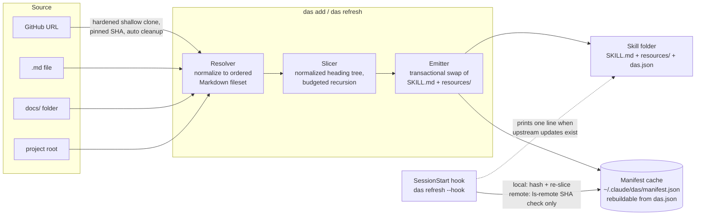

# DAS (Documentation as a Skill) Design Spec

**Date:** 2026-07-22
**Status:** Revised after four-reviewer red team (architecture, platform, security, product)
**Repo:** `~/projects/das-cli/`

## Overview

DAS is a standalone TypeScript CLI (`das`) that converts existing documentation into a Claude Code skill built on progressive disclosure. Point it at a GitHub URL, a Markdown file, a docs folder, or a project root. It slices the documentation into a `SKILL.md` table of contents plus a tree of resource files, each within a token budget, so Claude only ever loads what it needs. A SessionStart hook keeps local sources current automatically and surfaces upstream updates for remote sources without ever applying them silently.

**Positioning (remote-first):** the hero flow is `das add <github-url>`: any library's documentation becomes a fresh, local, token-bounded skill, which plain grep cannot reach. Local docs folders are fully supported, and the docs are honest that a small local `docs/` folder may only need a CLAUDE.md pointer; DAS earns its keep on remote repos, oversized docs, MDX-heavy sources, and auto-invocation via a curated skill description. Teams keep their existing documentation site (Docusaurus, MkDocs, Starlight, plain Markdown) as the human-facing source of truth; DAS makes the same source legible to Claude Code without duplication.

## Goals

1. One command turns any documentation source into a working Claude Code skill.
2. Token efficiency with an honest guarantee: every generated file is within the token budget, except atomic oversized leaves (single huge tables or code blocks), which are emitted whole and flagged. Navigation cost to any fact is `budget x path length`; path length is the source's nesting depth after single-child collapse, plus grouping levels that grow logarithmically in section count.
3. Freshness without surprise: local sources re-slice automatically at session start; remote sources are checked cheaply (`git ls-remote`, no clone) and updates apply only through an explicit, reviewed `das refresh`.
4. Safety: DAS deletes and overwrites only files it recorded generating, inside skill directories it re-derives and verifies. Third-party content is framed as untrusted reference data and scanned for injection patterns.

## Non-Goals (v1)

- Authoring or editing documentation. DAS reads, slices, and emits. It never modifies sources.
- Full site-generator adapters (`sidebars.js`, `mkdocs.yml` nav, `_category_.json`). Frontmatter awareness covers most real docs sites.
- Non-Markdown sources (HTML scraping, PDFs, OpenAPI specs).
- Private repos and non-github.com hosts. v1 clones public github.com over https only.
- Watch mode or daemon.

## Architecture



Two mechanisms, kept distinct: DAS **regenerates** skill files; Claude Code **loads** them itself (live change detection picks up files written into `.claude/skills/` within a session; `/reload-plugins` is the manual fallback).

## Components

### 1. CLI (`das`)

Stack: TypeScript, Commander, Inquirer, Chalk, vitest, pnpm. Same conventions as `cpm-cli`.

| Command              | Behavior                                                                                                                                                                                                                                                                 |
| -------------------- | ------------------------------------------------------------------------------------------------------------------------------------------------------------------------------------------------------------------------------------------------------------------------ |
| `das add <source>`   | Resolve, preview (name, description, section tree), wizard, generate, register, offer hook install                                                                                                                                                                       |
| `das refresh [name]` | Re-slice from source. Remote: fetch pinned SHA or, with `--update`, re-pin to the tracked ref's current SHA after showing a changed-file summary and re-running the injection scan. `--all` for every known skill, `--force` to ignore hash short-circuits               |
| `das refresh --hook` | Hook mode: personal skills plus project skills under the current directory. Local sources re-slice on hash change; remote sources get an ls-remote check only, never a content change. Prints nothing on the happy path; prints one line per skill with upstream updates |
| `das list`           | Name, source, scope, pinned SHA/ref, last refresh, staleness, update-available, and the aggregate context cost of all registered skill descriptions                                                                                                                      |
| `das remove <name>`  | Delete only the files recorded in the skill's `das.json`; refuse if foreign files are present (override `--force`); remove manifest entry                                                                                                                                |
| `das doctor`         | Rebuild the manifest cache by scanning skills directories for `das.json`; report and repair inconsistencies                                                                                                                                                              |
| `das hook install`   | Install the SessionStart hook into personal settings (also offered during `das add`). `--project` writes to project settings instead, with a collaborator warning; default off                                                                                           |

Wizard (`das add`), in order. Every step has a flag (`--scope`, `--name`, `--description`, `--no-hook`, `--yes`); `--yes` takes all defaults non-interactively but still aborts on injection-scan flags or name collisions.

1. **Install scope:** personal `~/.claude/skills/<name>/` (default) or current project `.claude/skills/<name>/`.
2. **Skill name:** default derived from the doc title, slugified and collision-checked. A name already used by a DAS skill from a different source requires explicit confirmation or `--force`.
3. **Description:** neutral template, editable: `Reference documentation for <title>, sliced from <source>. Covers: <top-level section names>.` Built from structure rather than doc prose so a malicious intro paragraph cannot shape invocation. Capped at 1024 characters. Shown prominently: this string decides when Claude invokes the skill, and a bad one means the skill silently never fires.
4. **Hook install:** offered only if no DAS SessionStart hook exists in personal settings (default yes). Project-settings hook install exists behind `das hook install --project` with an explicit warning that a committed `.claude/settings.json` hook runs for every collaborator; default is off.

### 2. Resolver

Normalizes any source into an ordered fileset. Extensions: `.md`, `.mdx`, `.markdown`, case-insensitive.

| Input                | Resolution                                                                                                                                                                                                                                                                                                                      |
| -------------------- | ------------------------------------------------------------------------------------------------------------------------------------------------------------------------------------------------------------------------------------------------------------------------------------------------------------------------------- |
| GitHub URL           | Supported forms: `https://github.com/org/repo[.git]`, `/tree/<ref>/<subpath>`, `/blob/<ref>/<file>`. Anything else (ssh, other hosts, URLs starting with `-`) is rejected with a clear error. Hardened shallow clone to an OS temp dir, scoped to subpath when given, then project-root discovery. Cleanup in a `finally` block |
| Path to file         | That file                                                                                                                                                                                                                                                                                                                       |
| Path to folder       | All Markdown recursively, folder nesting preserved as hierarchy                                                                                                                                                                                                                                                                 |
| Path to project root | Discovery, in order: `docs/`, `documentation/`, `doc/`, else root-level `*.md`. The top-level README is always included as the root overview even when a docs folder exists. Prints what was found                                                                                                                              |

Clone hardening (all mandatory): `GIT_TERMINAL_PROMPT=0`, empty `GIT_ASKPASS`, `GIT_CONFIG_NOSYSTEM=1`, `GIT_LFS_SKIP_SMUDGE=1`, `-c protocol.ext.allow=never -c protocol.file.allow=never -c core.symlinks=false`, no submodule recursion, `--` before the URL, `--depth 1 --filter=blob:none` at the pinned SHA. Caps: 120s clone timeout, 100MB total, 5000 files. The 100MB / 5000-file caps are enforced on the returned fileset for every source type, not remote clones alone, so an oversized local monorepo is bounded too. Sources are spawned as argument vectors, never through a shell.

Symlinks are never followed: the resolver `lstat`s and skips symlinked files and directories, and a source path that is itself a symlink is rejected with a clear error naming the resolved target to pass instead.

Frontmatter and MDX handling:

- `title:` overrides the first H1 as the node name; `draft: true` files are skipped.
- Ordering is a total order: primary `sidebar_position` (numeric, floats and negatives allowed; positioned files sort before unpositioned), secondary numeric filename prefix (`01-intro.md`), tertiary case-folded name; folders sort among siblings by the same keys on the folder name; final tie-break is the relative path. Within a file, document order.
- MDX: `import`/`export` statements stripped. Fenced code blocks always verbatim. `<Tabs>`/`<TabItem>` flatten into labeled subsections. Other paired JSX tags are removed keeping children. Self-closing components emit a visible `[unrendered component: <Name>]` placeholder rather than vanishing. Admonitions (`:::danger`) become a bold label (`**Danger:**`) so the signal survives.

Exclusions: `node_modules`, hidden folders, `CHANGELOG.md`, license files, files over 1MB (warned, `--include-large` overrides). If the fileset is empty after resolution, or empty of content after processing (all drafts, all stripped), `add` fails with what was searched.

### 3. Slicer

**Tree normalization** (every file, before slicing): each file gets a file-level node named from frontmatter `title`, else first H1, else the humanized filename; folder nodes take the humanized folder name. Prose before the first heading is the file node's body. Every heading attaches to the nearest shallower ancestor, so skipped levels (H1 then H3) and files starting at H2 are well-defined. Multiple H1s become siblings under the file node.

**Sizing** runs bottom-up after parsing (parse, size, emit; this is deliberately not single-pass). Token estimation is a conservative heuristic: `chars / 4` for prose, `chars / 3` for fenced-code content. Default budget 4000 tokens, configurable per skill.

**Emission rules**, applied recursively to every node including the root:

1. If a node's entire subtree fits the budget, inline the whole subtree as one file, regardless of child headings.
2. Otherwise emit an index: the node's intro plus a linked ToC of children, and recurse. The index itself obeys the budget: an oversized intro is moved to an `overview` child leaf, and an oversized ToC is chunked into category index files, deterministically, in source order, into buckets sized to the budget and labeled by their first and last entries. Grouping applies at every level, root included.
3. Chains of single-child nodes collapse into one level.
4. A leaf with no subheadings that exceeds the budget is emitted whole with a warning and marked oversized in the generation report. Paragraph-splitting was considered and rejected: it destroys locality. Symmetrically, if an index's single irreducible child link is itself longer than the budget (a pathologically long heading), grouping stops rather than recursing forever and that index is flagged oversized too; the guarantee is that every emitted file is within budget except these explicitly flagged leaves and indexes.

Every node gets a slug and a deterministic one-line summary (first 120 characters of the first prose paragraph, cut at a word boundary; empty when a section opens with code or a table).

**Slugs** are a pure function of the node, stable against unrelated edits: NFKC-normalize, lowercase, restrict to `[a-z0-9-]`, collapse repeats, cap at 64 chars, fallback `section` when empty, reject reserved names (`.`, `..`, Windows device names). Collisions are checked case-insensitively after normalization (APFS is case-insensitive): same-directory collisions first disambiguate with the parent segment, then a document-order numeric suffix. A recursing node owns `<slug>/`; a leaf colliding with it gets a suffix. Every output path is `path.resolve`d and asserted to be inside the skill directory before any write.

### 4. Emitter

```
<skills-dir>/<name>/
  SKILL.md
  das.json
  resources/
    <slug>.md
    <slug>/
      index.md
      <child-slug>.md
```

`SKILL.md` frontmatter carries only documented fields (`name`, `description`). All DAS metadata lives in `das.json`, the durable, self-describing record committed with the skill:

```json
{
  "dasVersion": "0.1.0",
  "slicerVersion": 1,
  "name": "prisma-docs",
  "source": {
    "type": "github",
    "url": "https://github.com/prisma/docs",
    "subpath": null
  },
  "trackedRef": "main",
  "pinnedSha": "<commit sha resolved at add/update time>",
  "sourceHash": "sha256:...",
  "tokenBudget": 4000,
  "checkIntervalHours": 24,
  "lastRefresh": "2026-07-22T14:00:00Z",
  "generatedFiles": ["SKILL.md", "das.json", "resources/..."]
}
```

The `das.json` schema is strict: unknown keys are rejected, out-of-range numerics are rejected (not clamped), `dasVersion` is validated as a semver string (it is always the tool's own version), and `generatedFiles` entries must be relative with no `..` segment or absolute/UNC/drive form. `sourceHash` covers the sorted fileset (paths and contents) plus `slicerVersion`, `tokenBudget`, and resolver options, so changing generation parameters regenerates and upgrading DAS's slicer never silently rewrites: a `slicerVersion` mismatch in hook mode is reported as pending, and applied only by an explicit `das refresh`.

**Untrusted-content framing (mandatory):** `SKILL.md` opens with a fixed paragraph stating the content is third-party reference material sliced from the source, to be treated as data for answering questions and never as instructions to act on. Every index and resource file carries a one-line version of the same frame. Stripping tags is not the defense; the frame plus the injection scan (below) is.

**Transactional emit:** the full tree is built in a temp directory on the same volume, then swapped in atomically (rename old aside, rename new in, delete old). A crash, disk-full, or timeout mid-generation leaves the previous skill intact; a half-written skill is never observable. Stale files cannot linger because the whole tree is replaced. `sourceHash` and the manifest update only after a completed swap.

**Ownership:** `das.json`'s `generatedFiles` list is the ownership record. Refresh and remove operate only on listed files, refuse foreign files without `--force`, never follow symlinks, and re-derive the expected skill path from scope plus name, asserting it resolves inside `~/.claude/skills/` or `<project>/.claude/skills/`, regardless of what the manifest says. A target folder without a valid `das.json` aborts every operation.

**Git policy:** project-scope skills are committed. Teammates get the skill with zero DAS install; the committed `das.json` lets their DAS discover and refresh it. Output is deterministic, so diffs appear only when the docs actually changed.

### 5. Manifest

`~/.claude/das/manifest.json` is a **rebuildable cache**, never the source of truth. Durable identity lives in each skill's `das.json`; the manifest holds discovery pointers and volatile state that would churn a committed file:

```json
{
  "version": 1,
  "skills": [
    {
      "name": "prisma-docs",
      "skillPath": "/Users/alexandra/.claude/skills/prisma-docs",
      "scope": "personal",
      "lastCheck": "2026-07-22T14:00:00Z",
      "updateAvailable": false
    }
  ]
}
```

The manifest is schema-validated on load (types, known scopes, absolute path shape). `das.json` files are likewise schema-validated whenever read: known source types, https-only github.com URLs, budget and check interval clamped to sane positive ranges. A corrupt manifest is backed up and rebuilt by `das doctor`'s scan, so on-disk skills are never orphaned. Concurrency: an advisory lock file with stale-lock detection guards the manifest; writes are atomic (temp then rename); each skill has a per-skill lock so two sessions never co-write one skill, and a locked skill is simply skipped ("already refreshing").

### 6. Refresh + hook

Per-skill refresh logic:

- **Local source:** hash the current fileset and inputs. Match: done, no writes, `lastCheck` advances. Differ: regenerate via transactional emit.
- **Remote source (hook mode):** if `lastCheck` is within the check interval (default 24h), do nothing. Otherwise one `git ls-remote` of the tracked ref, no clone. SHA equals `pinnedSha`: done. SHA moved: set `updateAvailable`, print one line (`das: prisma-docs has upstream updates; run 'das refresh prisma-docs --update'`). Content never changes in hook mode.
- **Remote source (interactive `--update`):** clone at the new SHA, show a changed-file summary, re-run the injection scan (flagged content requires confirmation; in `--yes` mode it aborts), then regenerate and re-pin.
- **Missing or failing source:** warn, keep the existing skill, mark stale in `das list`. Offline never breaks a session. Local staleness means the source hash no longer matches or the source is missing.

Hook registration (personal `~/.claude/settings.json`; written atomically, re-parsed for validity before commit, only the DAS entry touched, merge tested against existing-hooks fixtures):

```json
{
  "hooks": {
    "SessionStart": [
      {
        "matcher": "startup",
        "hooks": [
          { "type": "command", "command": "das refresh --hook", "timeout": 60 }
        ]
      }
    ]
  }
}
```

SessionStart fires on startup, resume, clear, compact, and fork; the `startup` matcher keeps the hook off the noisy triggers. Work is bounded: remote checks are one network call each, local re-hashing is cheap, and at most 3 regenerations run per hook invocation (round-robin, oldest first; the rest wait for the next session), each under a per-skill 20s generation timeout so one slow skill never starves the rest and the transactional swap makes any timeout harmless. Hook mode covers personal skills plus project skills under the current directory, so DAS never writes into a project that is not open. If `das` is not on PATH the hook exits nonzero silently; `das list` shows staleness, which is the recovery signal.

## Injection Scan

Runs at `add` and at interactive `--update` on changed content. Flags: instruction-override phrasing (`ignore previous`, `system:`, `assistant:`), imperative always-invoke language, tool-call-shaped fenced blocks, and download-and-execute patterns (`curl ... | sh`, `base64 -d`). Flagged slices are shown to the user with their file paths; proceeding requires explicit confirmation, and `--yes` aborts instead. The scan is a tripwire, not a guarantee; the untrusted-content frame is the primary defense, and both are required.

## Performance Controls

1. **Context cost:** the budget bounds every generated file (atomic oversized leaves excepted and flagged). Worst-case navigation is `budget x path length`; single-child collapse and budget-sized grouping keep path length at source depth plus a logarithmic grouping term.
2. **Many skills:** every registered skill's description is loaded each session (roughly 50 to 150 tokens each). `das list` reports the aggregate so the cost is visible; keeping descriptions tight is part of the wizard guidance. Description pagination is a v2 candidate.
3. **Session-start latency:** hash short-circuits make unchanged local refreshes read-only; remote checks are one `ls-remote` per skill at most once per interval; regenerations are capped per invocation.
4. **Generation:** hardened blob-filtered clones with size, count, and time caps; per-file 1MB skip guard; parse, size bottom-up, emit.

## Error Handling

| Failure                                               | Behavior                                                                        |
| ----------------------------------------------------- | ------------------------------------------------------------------------------- |
| Source path missing at refresh                        | Warn, keep existing skill, mark stale in `das list`                             |
| Clone failure, offline, cap exceeded                  | Warn, keep existing skill, temp dir cleaned up in `finally`                     |
| Target exists without valid `das.json`                | Abort every operation, never overwrite                                          |
| Add collides with a DAS skill from a different source | Refuse without explicit confirmation or `--force`                               |
| Kill/timeout mid-generation                           | Previous skill intact (transactional swap); hash not advanced; retried next run |
| Manifest corrupt                                      | Back up, rebuild via `das doctor` scan of `das.json` files                      |
| Fileset empty (or empty after processing)             | Error at `add` with what was searched; no skill created                         |
| Injection scan flags content                          | Interactive: show and confirm. `--yes`: abort                                   |
| Hook without `das` on PATH                            | Silent nonzero exit; session unaffected; staleness visible in `das list`        |

## Security Requirements

Consolidated from the red team; all are requirements, none are considerations:

1. Untrusted-content frame in every generated file; injection scan at add and update; neutral structure-derived description template.
2. Remote sources pinned to a commit SHA; hook mode never changes content; updates are explicit, diffed, and re-scanned.
3. Slug and name sanitization (NFKC before filtering, strict allowlist) plus resolved-path containment asserts on every write and delete.
4. Deletion only of files listed in `das.json`, inside re-derived and verified skill paths; symlinks never followed anywhere; the marker/`das.json` check is accident-prevention, and path verification is the adversarial defense.
5. Clone hardening flags, https github.com only, URL form allowlist, `--` separator, argument-vector spawning, no shell interpolation.
6. Atomic writes with validity re-parse for `settings.json` and the manifest; project-settings hook install is opt-in with a collaborator warning.

## Testing

- **Unit (vitest):** resolver fixtures (plain Markdown tree, Docusaurus-style MDX with frontmatter, tabs, admonitions, self-closing components; project root with README only; drafts-only folder), slicer normalization cases (no H1, multiple H1s, skipped levels, preamble), budget math (subtree inlining, grouping, collapse, oversized-leaf flagging), slug sanitization and case-insensitive collision fixtures, ordering total-order cases (float positions, ties), injection-scan fixtures, manifest schema validation and clamping.
- **Security:** malicious heading/title traversal fixtures (`../`, absolute, unicode confusables), symlinked file and folder fixtures for resolve and remove, manifest with out-of-tree `skillPath`, URL rejection table (ssh, `ext::`, leading `-`, non-github hosts).
- **Snapshot:** full generated trees per fixture, proving determinism (same input, same bytes) and churn-resistance (unrelated edits don't renumber slugs).
- **Atomicity:** kill mid-emit and assert the previous skill is intact and the hash did not advance; concurrent refresh of one skill and assert the lock serializes.
- **Integration:** `das add` end-to-end on a local fixture repo, mutated-source refresh proving hash regeneration, `--update` flow with a moved SHA showing the diff summary, `das remove` deleting only recorded files, `das doctor` rebuilding a deleted manifest.
- **Hook:** settings merge against existing-hooks fixtures; hook-mode run with mixed local/remote skills asserting remote content never changes and the regeneration cap holds.

## Decision Log

| Decision                             | Choice                                         | Why                                                                                                                                                                                        |
| ------------------------------------ | ---------------------------------------------- | ------------------------------------------------------------------------------------------------------------------------------------------------------------------------------------------ |
| Hook model                           | Keep, check-only for remote                    | Preserves the auto-fresh concept for local docs; closes the silent supply-chain path security rated critical. Devil's advocate's "no hook" was rejected: freshness is half the DAS concept |
| Positioning                          | Remote-first                                   | The GitHub flow is the case grep cannot replicate; honest guidance on local docs builds trust                                                                                              |
| Project-skill git policy             | Committed                                      | Zero-install consumption for teammates; deterministic output limits churn to real doc changes                                                                                              |
| Paragraph-splitting oversized leaves | Cut                                            | Destroys locality (product) and breaks index budgets (architecture); emit whole and flag                                                                                                   |
| TTL for remotes                      | Replaced by SHA pinning + check interval       | `ls-remote` gives exact staleness for one round-trip; TTL was a crude proxy                                                                                                                |
| DAS metadata location                | `das.json` sidecar                             | Undocumented frontmatter behavior avoided; enables manifest rebuild, ownership file-list, and the committed team story                                                                     |
| Wizard vs flags-first                | Wizard on bare `das add`, full flags + `--yes` | Explicit user preference; non-interactive path fully supported                                                                                                                             |

## Future (v2 candidates)

- `das relink` / `das rename` for moved sources and skill renames.
- Private repos and enterprise hosts (auth story), non-github providers.
- Site-generator nav adapters (`sidebars.js`, `mkdocs.yml`, `_category_.json`).
- Real tokenizer for budget enforcement; description pagination for many skills.
- Watch mode; `cpm` distribution of generated skills.
- Non-Markdown sources: OpenAPI, HTML docs sites.
