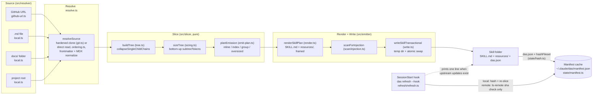
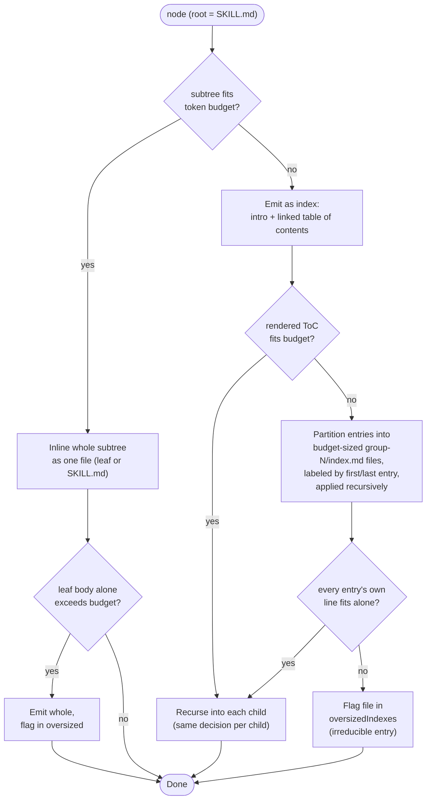

# Architecture

## Pipeline: resolve, slice, render, write

Every source type funnels through the same four stages. The resolver produces a plain fileset; the slicer is pure (no filesystem, no network); the emitter is the only stage that touches disk for the skill itself.

Two mechanisms stay distinct: `das` **regenerates** skill files on disk; Claude Code **loads** them itself. Nothing in this pipeline pushes content into a running session.

For the refresh sequence (local re-hash vs. remote pin-and-check), see [Pin-and-check refresh](/docs/concepts/refresh-and-freshness).

## Skill-tree emission

`planEmission` walks the sized tree top-down, deciding per node whether its whole subtree can be inlined or must become an index with children of its own. See [Progressive disclosure](/docs/concepts/progressive-disclosure) for a real generated example of this decision.

Grouping (`group-1`, `group-2`, ...) only appears when a single index's table of contents itself would not fit the budget; most skills never need it. Single-child chains collapse before this stage runs, so a folder containing exactly one file never produces a redundant nesting level. Every path this stage decides is later re-resolved and containment-checked before anything is written, so a malicious or malformed node name can plan a path but never write outside the skill directory.

## Module map

| Concern                     | Modules                                                                 |
| --------------------------- | ----------------------------------------------------------------------- |
| Shared types                | `src/types.ts`                                                          |
| Markdown primitives         | `src/markdown/{frontmatter,mdx,tokens,slug,summary}.ts`                 |
| Resolve                     | `src/resolver/{resolve,local,github-url,git,ordering}.ts`               |
| Slice (pure)                | `src/slicer/{tree,sizing,build-sized-tree,emit-plan}.ts`                |
| Render + write              | `src/emitter/{render,das-json,write}.ts`                                |
| Injection scan (pure)       | `src/scan/injection.ts`                                                 |
| State: manifest, lock, hash | `src/state/{manifest,lock,hash}.ts`                                     |
| Refresh engine              | `src/refresh/refresh.ts`                                                |
| SessionStart hook install   | `src/settings/hooks.ts`                                                 |
| CLI shells + command cores  | `src/cli/{index,add,refresh-cmd,list,remove,doctor,hook-cmd,wizard}.ts` |

The pure-core / effectful-shell split runs through this whole map: everything under `markdown/`, `slicer/`, and `scan/` is pure functions over in-memory values; everything under `resolver/`, `emitter/`, `state/`, `refresh/`, and `settings/` wraps an effect (filesystem, git, the clock, a lockfile) behind a function signature. See [`docs/architecture.md`](https://github.com/codewizwit/das-cli/blob/main/docs/architecture.md) in the repo for the full design rationale.
