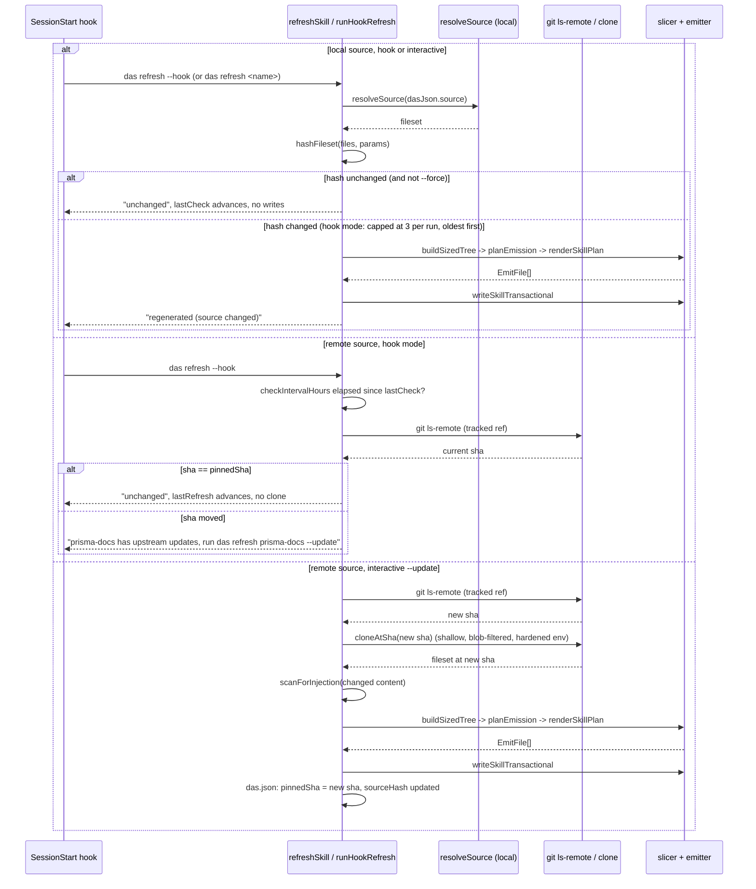

# Pin-and-check refresh

Freshness works differently depending on where the source lives.

- **Local source**: re-hashed on every `SessionStart`. A changed hash triggers an automatic re-slice, no confirmation needed, since nothing left your machine.
- **Remote source**: pinned to an exact commit sha at `das add` time. The hook only ever runs `git ls-remote` to check whether the tracked ref moved, never a clone, and never changes content on its own. When it has moved, `das` prints one line telling you to run `das refresh <name> --update`, which clones at the new sha, shows a changed-file summary, re-runs the [injection scan](/docs/security#injection-scan), and only then regenerates and re-pins.

A remote sha that moved is never silently applied. It stays flagged (`updateAvailable`) and re-reported on every subsequent hook run until an explicit `--update` clears it.

## The SessionStart hook

`das hook install` wires `das refresh --hook` into a Claude Code `SessionStart` hook, so every new session checks registered skills automatically:

- Runs read-only against remote sources (`git ls-remote` only, per the invariant above).
- Local regeneration in hook mode is capped at 3 skills per run, oldest `lastRefresh` first; anything beyond the cap waits for the next session.
- Installs into your personal settings by default; `--project` installs into the project's committed `.claude/settings.json` so the hook runs for every collaborator, which is why that path requires confirmation. See [`das hook install`](/docs/commands/hook-install) for the flags.

Full command flags: [`das refresh`](/docs/commands/refresh), [`das hook install`](/docs/commands/hook-install).
